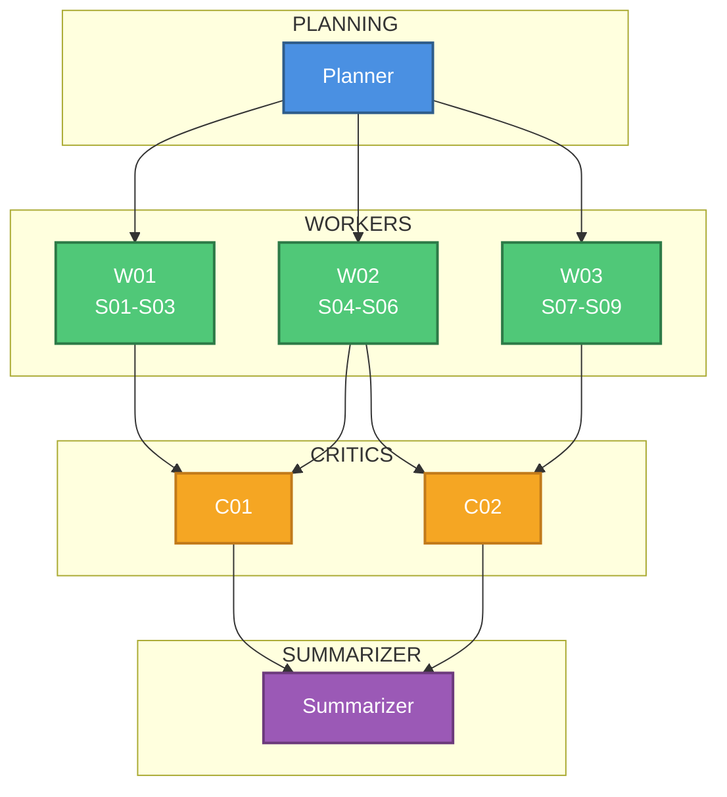
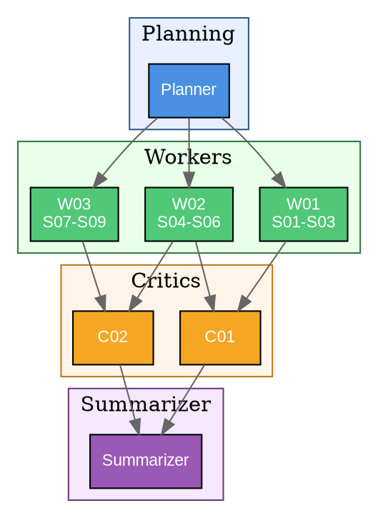

# Diagram Templates for Fan-Out Analysis

Templates for visualizing the Worker → Critic → Summarizer pipeline. Generate one diagram per plan using the parameters you computed.

## Mermaid Template

Use Mermaid when the plan is written to a markdown file (most cases). Adapt the node counts to match your computed layout.

### Mermaid Syntax Notes

- **Node labels**: Use `"W01 S01-S03"` to show which segments each worker handles. ` ` creates a line break inside the node.
- **Subgraphs**: Wrap each stage in `subgraph id["DISPLAY NAME"] ... end`. The quoted display name supports spaces and caps.
- **Styling**: Define styles with `classDef` and apply with `class node1,node2 styleName`. Place style definitions at the end.
- **Edges**: Write each edge explicitly (`P --> W01`). Mermaid does not reliably support `P --> {W01, W02}` shorthand.
- **Scaling**: For large layouts (>10 workers), consider collapsing into a summary node like `W01_10["W01-W10 30 segments"]` to keep the diagram readable.

### Mermaid Gotchas

1. Node IDs are case-sensitive. `W01` and `w01` are different nodes.
2. Subgraph node association: a node belongs to the first subgraph it appears in. Declare nodes inside their subgraph.
3. Special characters in labels need double quotes: `A["Label with --> arrow"]`.
4. Long diagrams render poorly. Cap at ~15 visible nodes. Collapse ranges for larger layouts.

## Graphviz (DOT) Template

Use Graphviz when the user requests it, or when you need publication-quality output. Graphviz produces cleaner layouts for large graphs.

### Graphviz Syntax Notes

- **Fan-out shorthand**: `P -> {W01; W02; W03};` creates edges from P to all three nodes. Use semicolons inside braces, not commas.
- **Fan-in shorthand**: `{C01; C02} -> S;` creates edges from both critics to the summarizer.
- **Clusters**: Only subgraphs named `cluster_*` draw bounding boxes. Regular `subgraph` is structural only.
- **Line breaks in labels**: Use `\n` (not ` `).
- **Rendering**: `dot -Tpng graph.dot -o graph.png` or `dot -Tsvg graph.dot -o graph.svg`.

### Graphviz Gotchas

1. Every statement needs a semicolon terminator.
2. The `cluster_` prefix is required for visual bounding boxes.
3. `rankdir=TB` affects the entire graph — you cannot mix vertical and horizontal sections.
4. Edge shorthand `{A; B} -> {C; D}` creates the full cross product (4 edges). Be explicit if you want specific pairings.

## When to Use Which

| Criterion | Mermaid | Graphviz |
|-----------|---------|----------|
| Output target | Markdown files, GitHub PRs | Rendered images, publications |
| Large graphs (>15 nodes) | Collapse to ranges | Handles natively |
| User familiarity | More common | Less common |
| Layout control | Limited | Fine-grained |
| Default choice | **Yes** | Only if requested |
