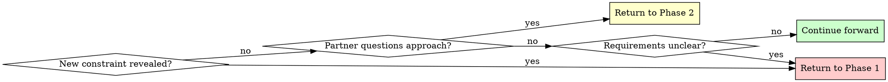

# Brainstorming Ideas Into Designs

## Overview

Transform rough ideas into fully-formed designs through structured questioning and alternative exploration.

**Core principle:** Ask questions to understand, explore alternatives, present design incrementally for validation.

**Announce at start:** "I'm using the brainstorming skill to refine your idea into a design."

## Quick Reference

| Phase | Key Activities | Tool Usage | Output |
|-------|---------------|------------|--------|
| **1. Understanding** | Ask questions (one at a time) | AskUserQuestion for choices, agents for research | Purpose, constraints, criteria |
| **2. Exploration** | Propose 2-3 approaches | AskUserQuestion for approach selection, agents for patterns | Architecture options with trade-offs |
| **3. Design Presentation** | Present in 200-300 word sections | Open-ended questions | Complete design with validation |

## The Process

**REQUIRED: Create TodoWrite tracker at start**

Use TodoWrite to create todos for each phase:

- Phase 1: Understanding (purpose, constraints, criteria gathered)
- Phase 2: Exploration (2-3 approaches proposed and evaluated)
- Phase 3: Design Presentation (design validated in sections)

Mark each phase as in_progress when working on it, completed when finished.

## Research Agents

**DO NOT perform deep research yourself. Delegate to specialized agents.**

### When to Use codebase-investigator

**Use codebase-investigator when you need to:**
- Understand how existing features are implemented
- Find where specific functionality lives in the codebase
- Identify existing patterns to follow
- Verify assumptions about codebase structure
- Check if a feature already exists

**Example delegation:**
```
Question: "How is authentication currently implemented?"
Action: Dispatch codebase-investigator with: "Find authentication implementation, including file locations, patterns used, and dependencies"
```

### When to Use internet-researcher

**Use @agent-ed3d-research-agents:internet-researcher when available. Otherwise use WebSearch/WebFetch aggressively.**

**Use internet research when you need to:**
- Find current API documentation for external services
- Research library capabilities and best practices
- Compare technology options
- Understand current community recommendations
- Find code examples and patterns from documentation
- Verify "what's the latest version" type questions
- Look up "how do people solve X" patterns

**Example delegation (with agent):**
```
Question: "What's the recommended way to handle file uploads with this framework?"
Action: Dispatch internet-researcher with: "Find current best practices for file uploads in [framework], including official docs and common patterns"
```

**Example without agent (use WebSearch):**
```
Question: "What's the current Stripe API for subscriptions?"
Action: Use WebSearch for: "Stripe subscriptions API latest version 2025"
Then use WebFetch to read the official docs
```

**When to use internet research:**
- External API documentation (always get latest)
- "How do people solve X?" (community patterns)
- Library comparison (which one is maintained?)
- Best practices (what's current recommendation?)
- Version checking (what's latest?)

**Don't overdo it:**
- Don't research things Claude already knows well
- Don't research project-specific code (use codebase-investigator)
- Don't research for every small decision

**Balance:** Use research for external knowledge and current information. Use Claude's existing knowledge for general programming concepts.

### Research Protocol

**If codebase pattern exists:**
1. Use codebase-investigator to find it
2. Unless pattern is clearly unwise, assume it's the correct approach
3. Design should follow existing patterns for consistency

**If no codebase pattern exists:**
1. Use internet research to find external patterns
2. Present 2-3 approaches from research in Phase 2
3. Let user choose which pattern to adopt

**If agent/research can't find answer:**
- Redirect question to user via AskUserQuestion
- Explain what was searched and not found
- Present as a design decision for user to make

**Be persistent with research:**
- If first query doesn't yield results, refine the question
- Try alternative search terms or approaches
- Don't give up after one attempt

## Phase 1: Understanding

**Before asking questions:**

1. **Investigate current state** - DON'T do this yourself:
   - Dispatch codebase-investigator to verify project structure
   - Ask investigator to find existing architecture and patterns
   - Ask investigator to identify constraints from current codebase
   - Review investigator's findings before proceeding

2. **Then gather requirements:**
   - Mark Phase 1 as in_progress in TodoWrite
   - Ask ONE question at a time to refine the idea
   - **Use AskUserQuestion tool** when you have multiple choice options
   - **Use agents** when you need to verify technical information
   - Gather: Purpose, constraints, success criteria
   - Mark Phase 1 as completed when understanding is clear

**Example using AskUserQuestion:**
```
Question: "Where should the authentication data be stored?"
Options:
  - "Session storage" (clears on tab close, more secure)
  - "Local storage" (persists across sessions, more convenient)
  - "Cookies" (works with SSR, compatible with older approach)
```

**When to delegate vs ask user:**
- "Where is auth implemented?" -> codebase-investigator
- "What auth library should we use?" -> internet-researcher (if not in codebase)
- "Do you want JWT or sessions?" -> AskUserQuestion (design decision)

**Ask only useful, coherent, and effective questions:**
Do not ask a question when only one answer is useful, coherent, and effective. For example, in an auth system with magic links and social logins:

```
Example (WRONG):
What should happen when a logged-in user requests a magic link for their own email address?

1. Send new magic link (allow re-login)
   User can request magic links even when logged in. Useful for re-authentication or session refresh scenarios.
2. Return error or redirect to home
   Logged-in users can't request magic links. They must log out first. Simpler, prevents confusion.
3. Silent success (no email sent)
   Say 'check your email' but don't send anything. Prevents leaking login state but may confuse legitimate users.
```

In this case, only #1 is a useful, coherent, and effective option. Option #2 doesn't make any sense (magic links can be used to verify emails after a social login) and #3 is aggressively bad (lies to the user).

```
Example (WRONG):
How should the magic link token verification be structured?

1. Single-use token with immediate session creation
   Token is consumed on first click, session created immediately. Simple flow. User can't re-click the link. Standard pattern for passwordless auth.
2. Token valid for multiple users within TTL
   Token can be used multiple times within 15 minutes. Allows re-clicking link if session cookie is lost. More complex state management.
3. Token with idempotent verification
   First use creates session, subsequent uses within TTL return same session. Safe re-clicking, prevents double-session creation. Moderate complexity.
```

No reasonably secure system would do either options #2 or #3. The way this question is written obviously indicates one acceptable answer and the other two answers are trap answers. Do not suggest trap answers for human users.

**If you want to ask a question where there is only one useful, coherent, and effective path, state your assumption and continue onward.**

**Do not ask questions just to ask them. If you have no useful, coherent, and effective questions, cease asking questions.**

**If starting-a-design-plan already gathered context:**
- Phase 1 may be very short
- Focus on remaining unknowns
- Don't re-ask questions already answered in clarification
- Still complete Phase 1 (don't skip it)

## Phase 2: Exploration

**Before proposing approaches:**

1. **Research existing patterns** - DON'T do this yourself:
   - Dispatch codebase-investigator: "Find similar features and patterns used"
   - If similar feature exists, base one approach on that pattern
   - If no codebase pattern, use internet research: "Find recommended approaches for [problem]"
   - Review research findings before proposing

2. **Then propose approaches:**
   - Mark Phase 2 as in_progress in TodoWrite
   - Propose 2-3 different approaches based on research
   - At least one approach should follow codebase patterns (if they exist)
   - For each: Core architecture, trade-offs, complexity assessment
   - **Use AskUserQuestion tool** to present approaches as structured choices
   - Mark Phase 2 as completed when approach is selected

**Example using AskUserQuestion:**
```
Question: "Which architectural approach should we use?"
Options:
  - "Event-driven with message queue" (matches existing notification system, scalable, complex setup)
  - "Direct API calls with retry logic" (simple, synchronous, easier to debug)
  - "Hybrid with background jobs" (balanced, moderate complexity, best of both)
```

**Research integration:**
- If codebase has pattern -> Present it as primary option (unless unwise)
- If no codebase pattern -> Present internet research findings
- If research yields nothing -> Ask user for direction

## Phase 3: Design Presentation

- Mark Phase 3 as in_progress in TodoWrite
- Present in 200-300 word sections
- Cover: Architecture, components, data flow, error handling, testing
- **Use research agents if you need to verify technical details during presentation**
- Ask after each section: "Does this look right so far?" (open-ended)
- Use open-ended questions here to allow freeform feedback
- Mark Phase 3 as completed when all sections validated

**Output:** Validated design held in conversation context, ready for documentation.

## Question Patterns

### When to Use AskUserQuestion Tool

**Use AskUserQuestion for:**
- Phase 1: Clarifying questions with 2-4 clear options
- Phase 2: Architectural approach selection (2-3 alternatives)
- Any decision with distinct, mutually exclusive choices
- When options have clear trade-offs to explain
- When agent research yields no answer (present as open decision)

**Benefits:**
- Structured presentation of options with descriptions
- Clear trade-off visibility for partner
- Forces explicit choice (prevents vague "maybe both" responses)

### When to Use Open-Ended Questions

**Use open-ended questions for:**
- Phase 3: Design validation ("Does this look right so far?")
- When you need detailed feedback or explanation
- When partner should describe their own requirements
- When structured options would limit creative input

**Example decision flow:**
- "What authentication method?" -> Use AskUserQuestion (2-4 options)
- "Does this design handle your use case?" -> Open-ended (validation)

### When to Use Research Agents

**Use codebase-investigator for:**
- "How is X implemented?" -> Agent finds and reports
- "Where does Y live?" -> Agent locates files
- "What pattern exists for Z?" -> Agent identifies pattern

**Use internet research for:**
- "What's the current API for X?" -> Research finds docs
- "How do other projects solve Y?" -> Research finds patterns
- "What libraries exist for Z?" -> Research compares options

**Don't do deep research yourself** - you'll consume context and may hallucinate. Delegate to agents or use web tools.

## When to Revisit Earlier Phases



**You can and should go backward when:**
- Partner reveals new constraint during Phase 2 or 3 -> Return to Phase 1
- Validation shows fundamental gap in requirements -> Return to Phase 1
- Partner questions approach during Phase 3 -> Return to Phase 2
- Something doesn't make sense -> Go back and clarify
- Agent research reveals constraint you didn't know -> Reassess phase

**Don't force forward linearly** when going backward would give better results.

## Common Rationalizations - STOP

These are violations of the skill requirements:

| Excuse | Reality |
|--------|---------|
| "Idea is simple, can skip exploring alternatives" | Always propose 2-3 approaches. Comparison reveals issues. |
| "Partner knows what they want, can skip questions" | Questions reveal hidden constraints. Always ask. |
| "I'll present whole design at once for efficiency" | Incremental validation catches problems early. |
| "Checklist is just a suggestion" | Create TodoWrite todos. Track progress properly. |
| "I can research this quickly myself" | Use agents or web tools. You'll hallucinate or consume excessive context. |
| "Agent didn't find it on first try, must not exist" | Be persistent. Refine query and try again. |
| "Partner said yes, done with brainstorming" | Design is in conversation. Next step is documentation. |
| "I know this codebase, don't need investigator" | You don't know current state. Always verify. |
| "Obvious solution, skip research" | Codebase may have established pattern. Check first. |
| "Don't need internet research for this" | External knowledge and current docs matter. Research when relevant. |

**All of these mean: STOP. Follow the requirements exactly.**

## Key Principles

| Principle | Application |
|-----------|-------------|
| **One question at a time** | YOU MUST ask single questions in Phase 1, use AskUserQuestion for choices |
| **Delegate research** | YOU MUST use agents or web tools for codebase and internet research, never do it yourself |
| **Be persistent with research** | If search doesn't find answer, refine query and try again before asking user |
| **Follow existing patterns** | If codebase pattern exists and is reasonable, design must follow it |
| **Structured choices** | YOU MUST use AskUserQuestion tool for 2-4 options with trade-offs |
| **YAGNI ruthlessly** | Remove unnecessary features from all designs |
| **Explore alternatives** | YOU MUST propose 2-3 approaches before settling |
| **Incremental validation** | Present design in sections, validate each - never all at once |
| **TodoWrite tracking** | YOU MUST create TodoWrite todos at start, update as you progress |
| **Flexible progression** | Go backward when needed - flexibility > rigidity |
| **Internet research matters** | Use research agents or web tools for external knowledge and current information |

## After Brainstorming

When Phase 3 is complete, announce:

"Design is validated and ready for documentation."

**Next step:** The orchestrating skill (starting-a-design-plan) will invoke writing-design-plans to document this design.

**You do NOT:**
- Write design document (that's writing-design-plans)
- Set up worktrees (that's later in workflow)
- Create implementation plans (that's writing-plans)

**You DO:**
- Hold validated design in conversation context
- Have clear understanding of architecture, components, and approach
- Know which existing patterns were followed (from investigation)
